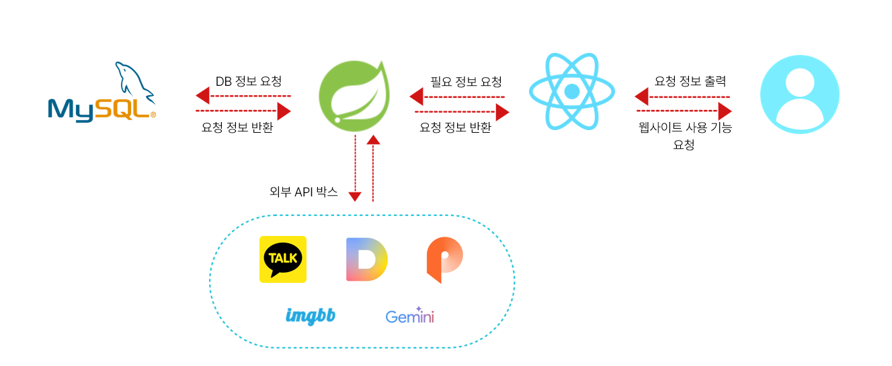
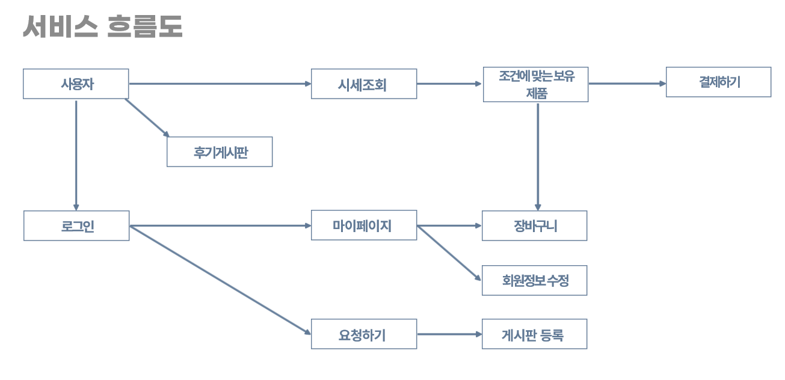
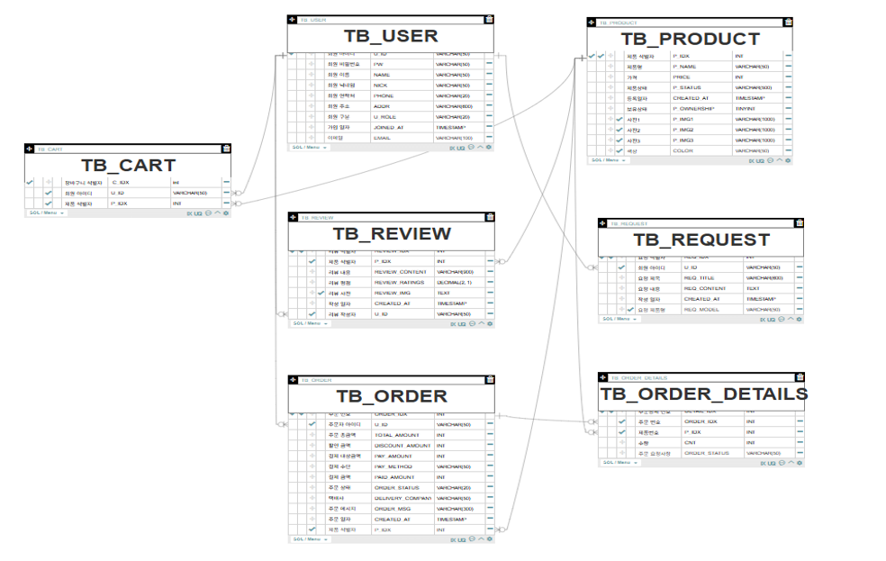
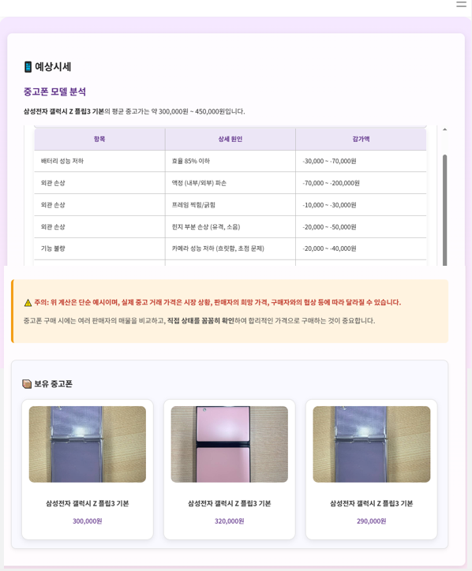
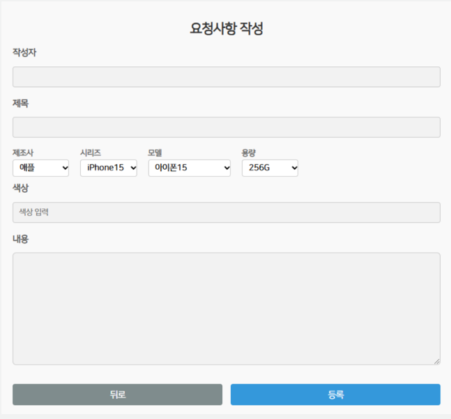
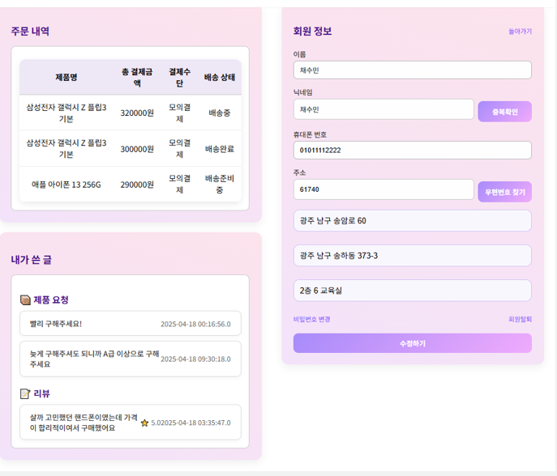
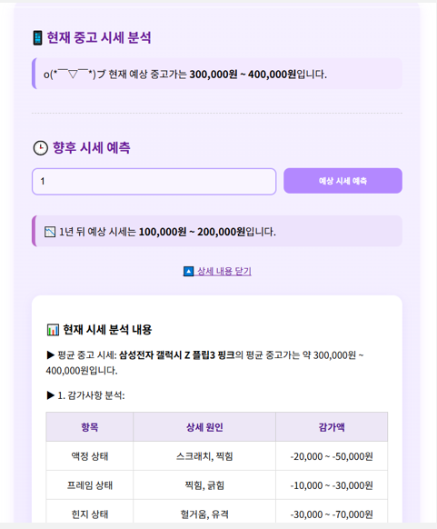
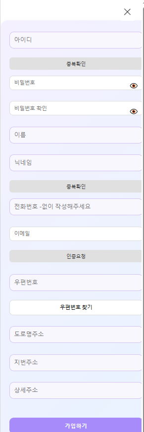

# 📱 세일수류찬 (SaleSuryuchan)
AI 기반 중고폰 시세 분석 및 거래 플랫폼  
중고폰 시세를 빠르고 정확하게, 개인 맞춤형 분석까지!

---

## 📌 프로젝트 소개

2020년대 중고폰 시장은 지속적으로 성장하고 있으며, 소비자들은 실시간 시세 파악과 신뢰도 있는 거래에 대한 니즈가 커지고 있습니다.  
**세일수류찬**은 Google Gemini AI를 기반으로 한 중고폰 시세 분석과 맞춤형 매물 요청 기능을 제공하는 **AI 기반 중고폰 거래 플랫폼**입니다.

> 중고폰 생태계의 불편함을 AI로 해결합니다!

---

## 👨‍👩‍👧‍👦 팀 소개

<table>
  <tr>
    <td align="center">
       
      <b>김찬유</b> PM / Front-End / Back-End
    </td>
    <td align="center">
       
      <b>이세일</b> Front-End / Crawling
    </td>
    <td align="center">
       
      <b>이찬익</b> 프롬프트 엔지니어링 / Back-End
    </td>
    <td align="center">
       
      <b>이찬영</b> Back-End / API 연동 및 전처리
    </td>
  </tr>
</table>

---

## 🔧 주요 기능

- 🤖 **AI 기반 시세 분석**  
  스마트폰 모델명을 입력하면 Gemini API로 실시간 분석 및 표 형식 결과 제공

- 🧠 **예상 시세 예측 기능**  
  향후 1~3년 뒤 예상 중고가 예측 기능 (표+요약 포함)

- 📝 **요청 게시판 시스템**  
  제품 리스트에 없는 모델은 게시판에서 판매자에게 직접 요청 가능

- 🖼 **이미지 업로드**  
  imgbb API 연동을 통한 이미지 URL 저장 및 출력

- 🔒 **SNS 로그인 (카카오)**  
  카카오 API 연동으로 간편 로그인 구현

- 💳 **포트원 결제 연동**  
  장바구니 담기 + Iamport API 연동으로 구매 기능 제공

- 📄 **후기/요청/마이페이지**  
  게시판 및 내 정보/글/구매 내역 관리

---

## 🧪 기술 스택

| 구분          | 기술 스택                      |
|---------------|-------------------------------|
| **Front-End** | React.js, JavaScript, CSS     |
| **Back-End**  | Spring MVC (eGovFrame), MyBatis |
| **AI 분석**    | Google Gemini API             |
| **이미지 업로드** | imgbb API                  |
| **주소 검색**   | Daum 우편번호 API             |
| **결제**       | PortOne (Iamport)             |
| **DB**         | MySQL                         |
| **협업 도구**   | VSCode, GitHub               |

---

## 🔄 시스템 아키텍처

> 외부 API 기반의 요청 흐름과 백엔드 연결 구조

---

## 🔁 서비스 흐름도

> 사용자 중심으로 구성된 전체 서비스 이용 순서

---

## 🧬 ER 다이어그램

> DB 테이블 간의 관계 구조를 명확히 표현

---

## 🧩 주요 화면 구성

### 📱 시세 조회  
> 기종/용량/색상 선택 후 Gemini AI 분석  

### 📝 요청 게시판  
> 미등록 제품 요청 등록  

### 📦 마이페이지 & 결제  
> 구매 내역, 장바구니, 회원정보  

### 🖨 예상 시세 예측  
> 향후 1~3년 뒤 예상 시세 분석  

### 🔐 로그인/회원가입  
> 카카오톡 API 연동 포함  

---

## 🎬 시연 영상

> 주요 기능 시연 영상 

[👉 시연 영상 바로가기](https://youtu.be/rqB_AN3xprQ)

---

## 🧠 Trouble Shooting

- 📄 **Markdown 시세 분석 테이블 가독성 문제**  
  → `extractMarkdownTable()` & `markdownTableToHTML()` 함수 커스텀 구현

- 🧵 **GZIP 한글 깨짐 현상 해결**  
  → InputStreamReader + BufferedReader 조합으로 인코딩 처리

- 🖼 **이미지 업로드 문제 (로컬 접근 제한)**  
  → imgbb API 활용 후 URL DB 저장 방식으로 구조 전환

---

## 🌱 향후 발전 방향

- 📈 Gemini AI 정확도 개선 → 예측 신뢰도 강화
- 🧩 사용자 요청 기반 상품 자동 등록 시스템 고도화
- 📡 통신사 및 부가 서비스 정보 연동
- 🤝 중고폰 전문 업체와의 전략적 제휴 추진

---

## 📚 참고자료

> 프로젝트 기획 및 시장 분석에 참고한 주요 기사 목록입니다.

- 이성진, 「국내 스마트폰 시장 축소…플래그십만 성장」, 아주경제  
  [https://www.ajunews.com/view/20240619163704575](https://www.ajunews.com/view/20240619163704575)

- 안상희, 「스마트폰 시장 침체인데 중고폰은 ‘인기’… 한국·일본·중국·인도서 수요 이끌어」, 조선일보  
  [https://biz.chosun.com/it-science/ict/2023/07/18/OT577N5N6VEUZKNABO5VCA6VNE/](https://biz.chosun.com/it-science/ict/2023/07/18/OT577N5N6VEUZKNABO5VCA6VNE/)

- 김민주, 「“새폰 안 사요” 국내 중고폰 시장 규모 2조원 달해」, 매거진한경  
  [https://magazine.hankyung.com/business/article/202401196892b](https://magazine.hankyung.com/business/article/202401196892b)

- 성유진, 「중고폰 구매할 때, 이것만은 꼭」, 조선일보  
  [https://www.newstof.com/news/articleView.html?idxno=11686](https://www.newstof.com/news/articleView.html?idxno=11686)

- 임유경, 「"갤Z6, 중고폰 보상구매로 사볼까"…정부, 중고폰 활성화 시동」, 이데일리  
  [https://www.edaily.co.kr/News/Read?newsId=03506326638957472&mediaCodeNo=257](https://www.edaily.co.kr/News/Read?newsId=03506326638957472&mediaCodeNo=257)
